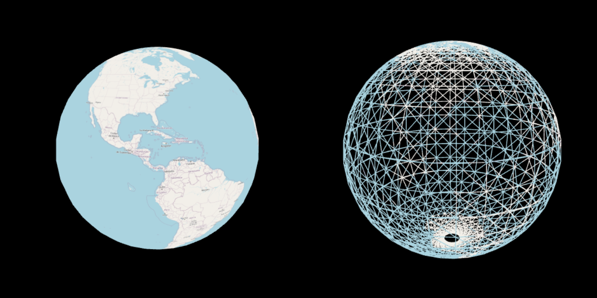

  

### Try Here: https://rpehkone.github.io/minimal-globe/

Raster tile globe rendered  
Holds state with quadtree  

### Build
```
npm run build
python3 -m http.server
```

### Todo
- To fix gaps / align tile with neighbour
    - Make sure neighbour tile is +- 1 only different
    - Update vertex buffer
    - Move middle vertices
